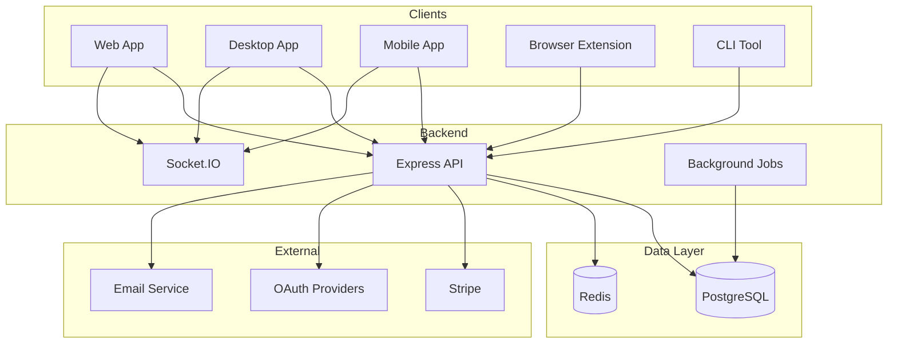
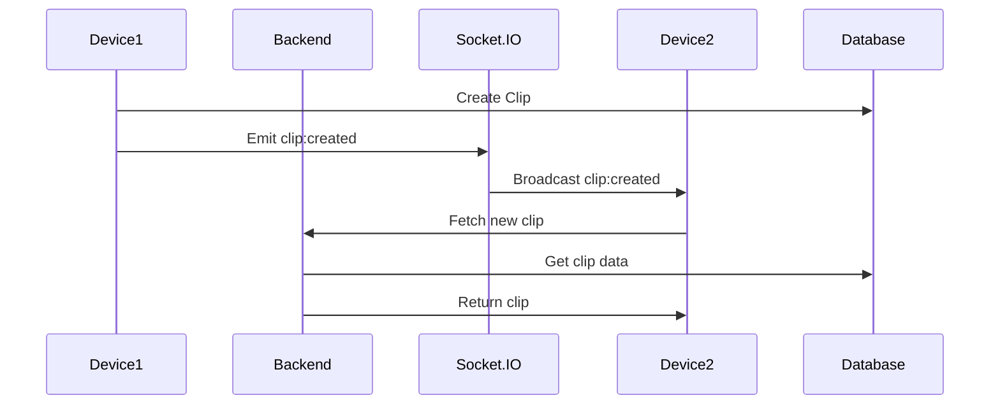
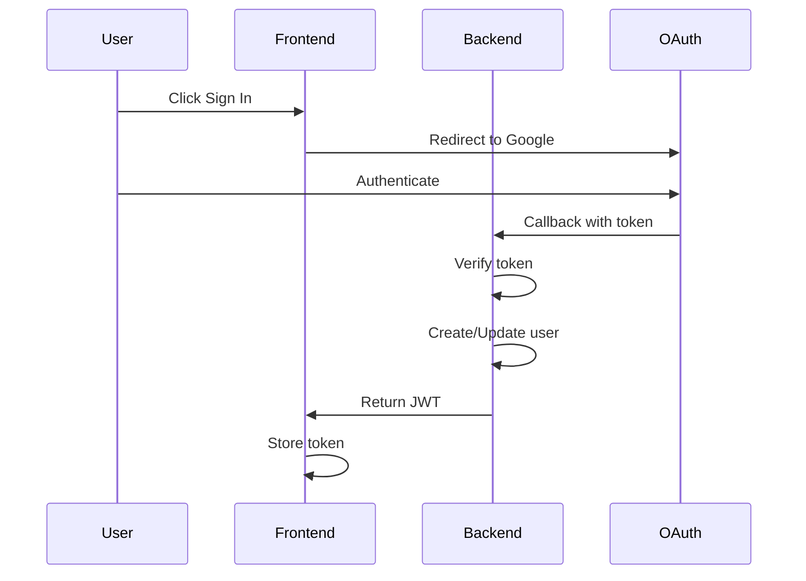
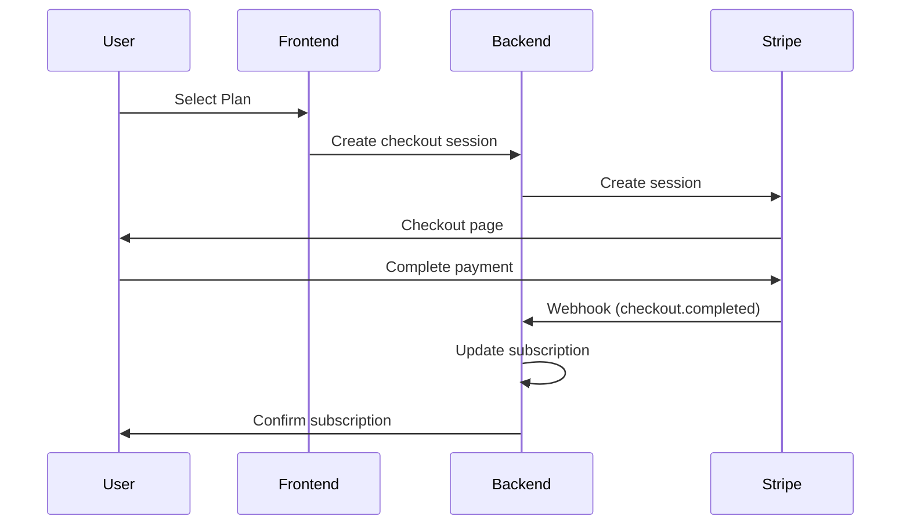

# Architecture Diagrams

## System Architecture

## Data Flow - Clipboard Sync

## Authentication Flow

## Payment Flow

---

See [SYSTEM-OVERVIEW.md](SYSTEM-OVERVIEW.md) for detailed architecture documentation.

