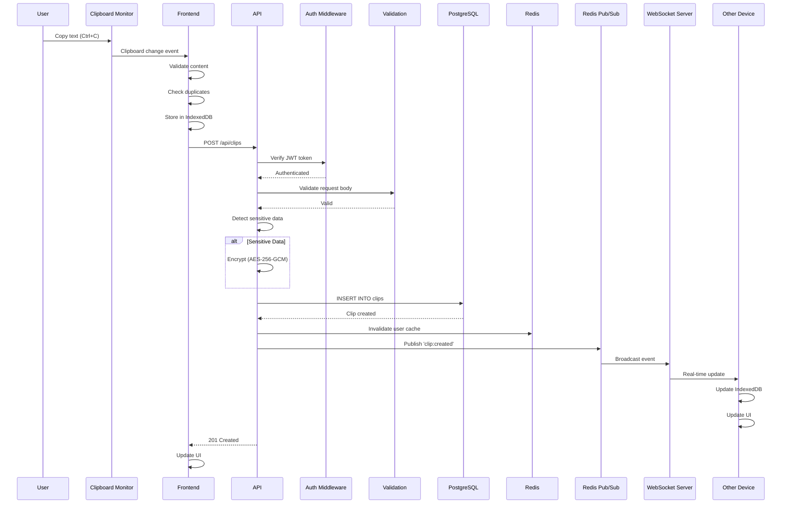
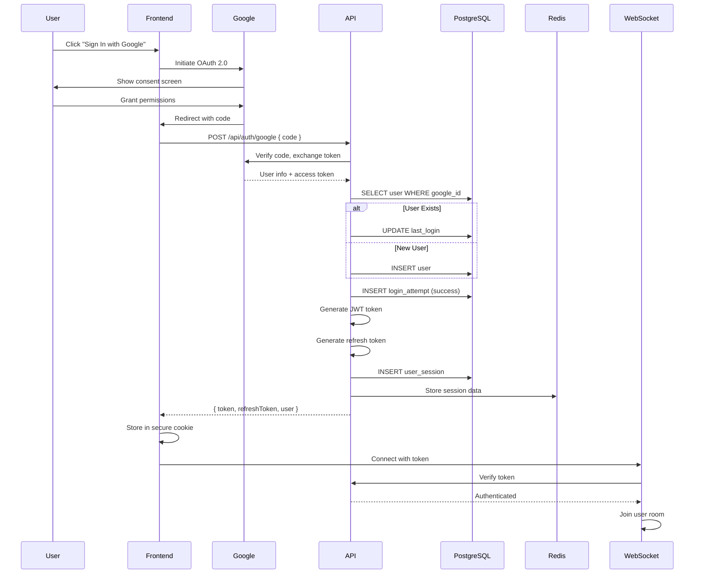
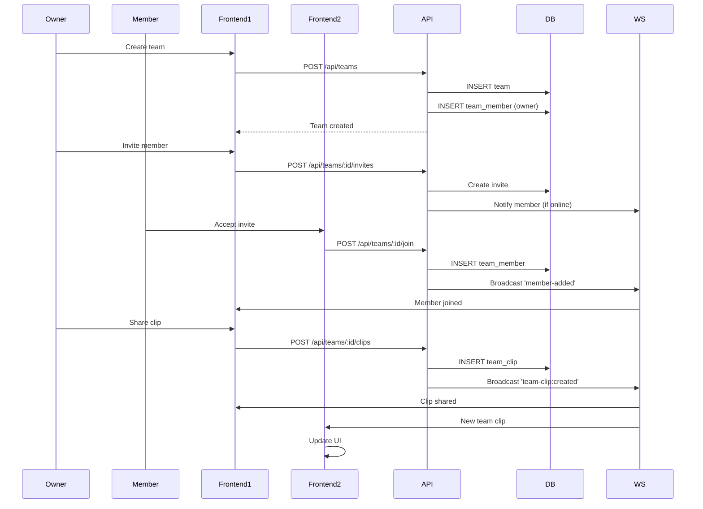
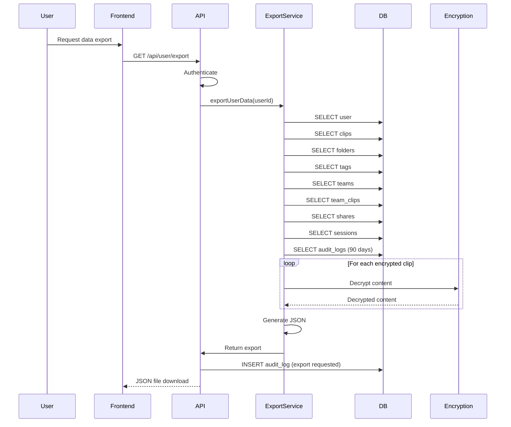
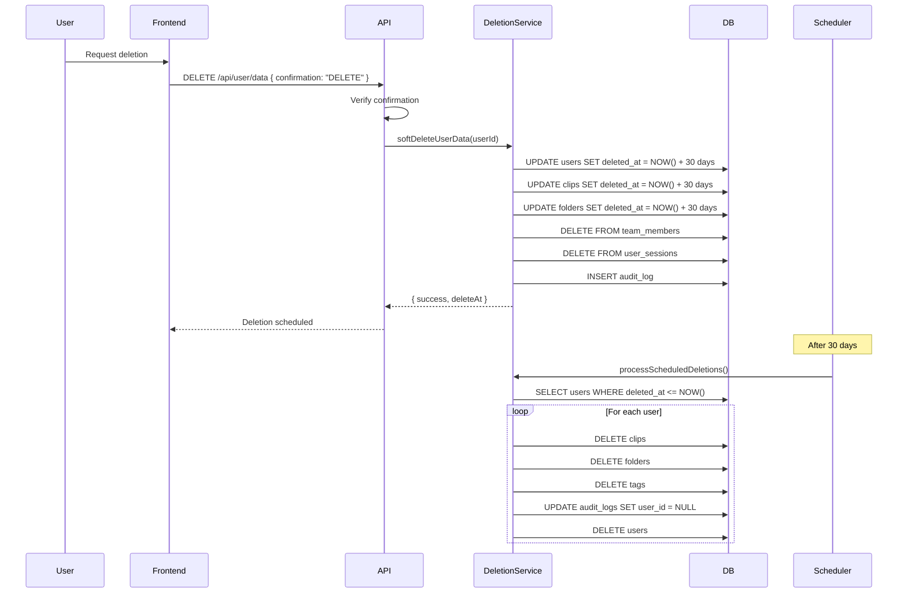
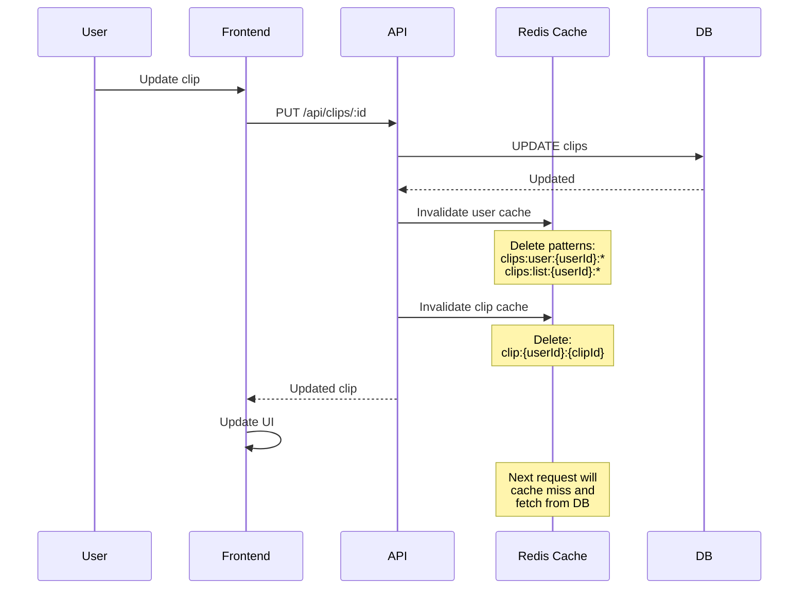
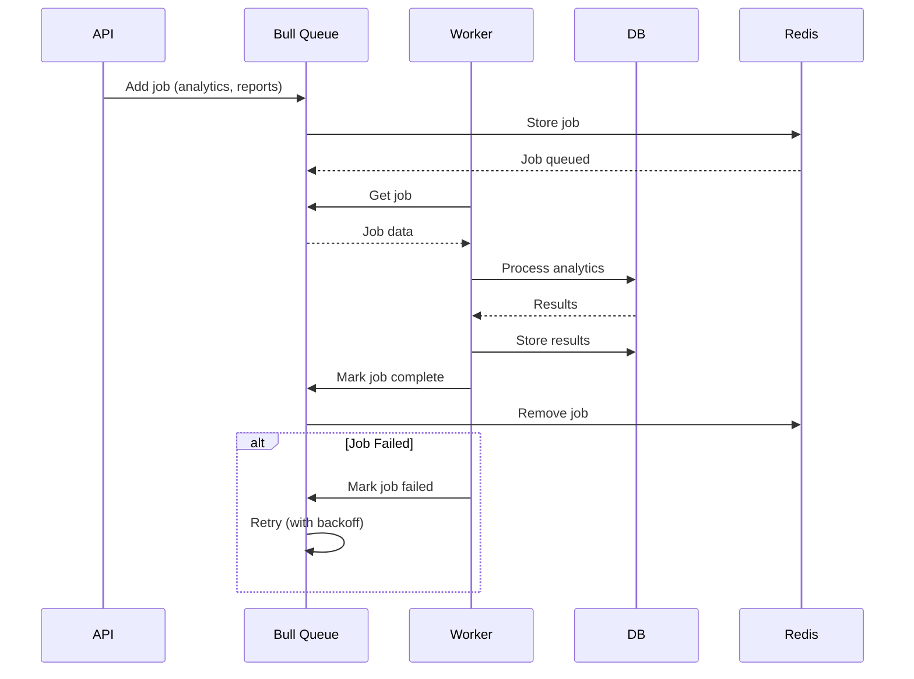

# ClipSync Data Flow Diagrams

This document provides detailed data flow diagrams for all major operations in ClipSync.

## Clipboard Synchronization Flow

## Authentication Flow

## Team Collaboration Flow

## GDPR Data Export Flow

## GDPR Data Deletion Flow

## Cache Invalidation Flow

## Background Job Processing Flow

