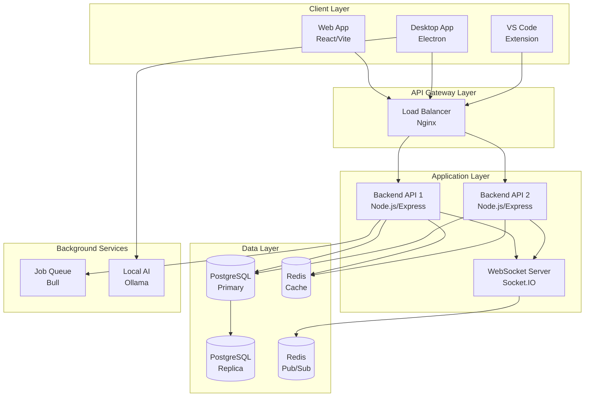
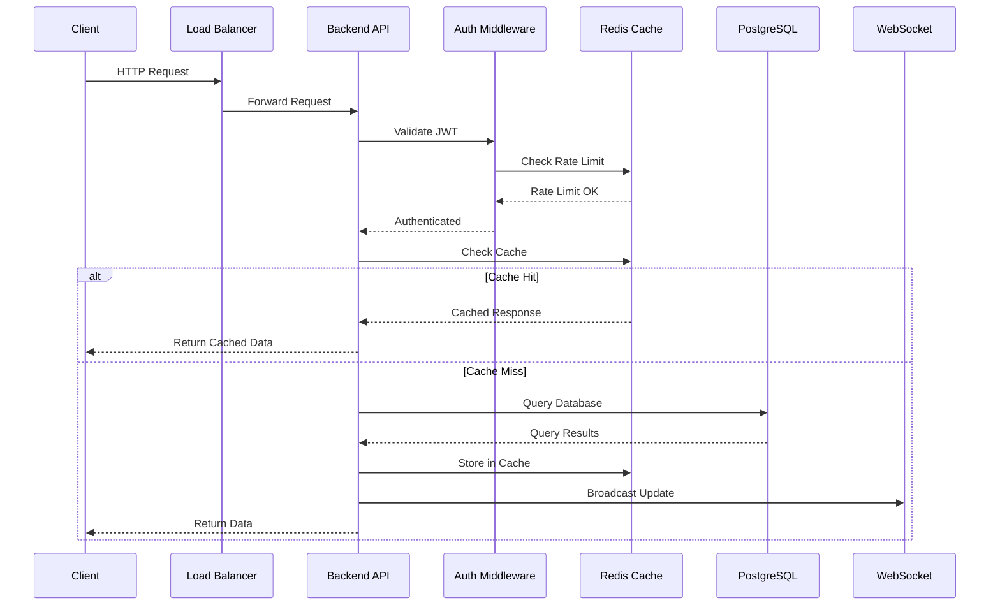
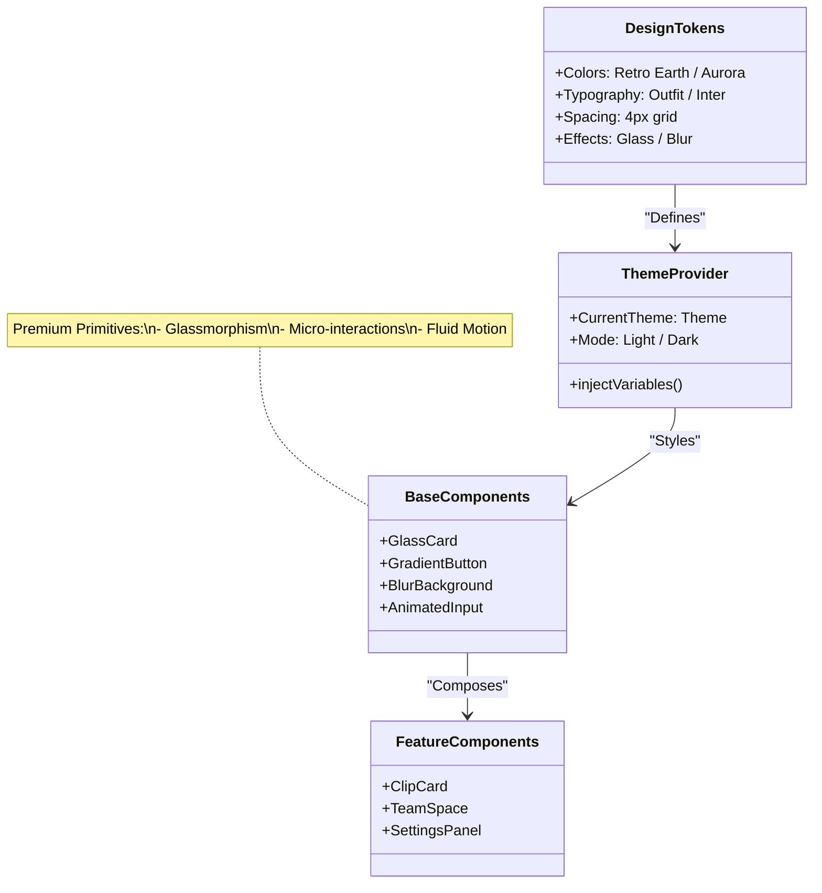
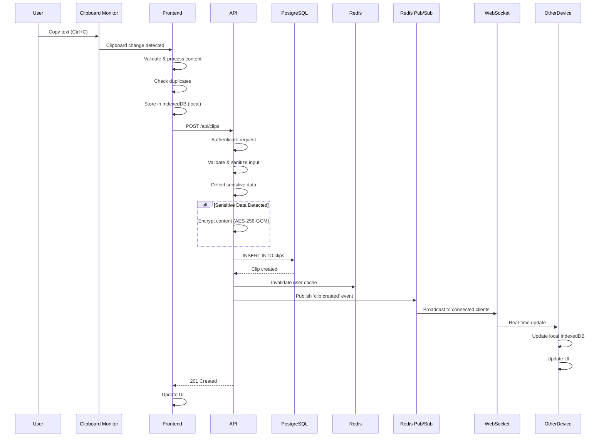
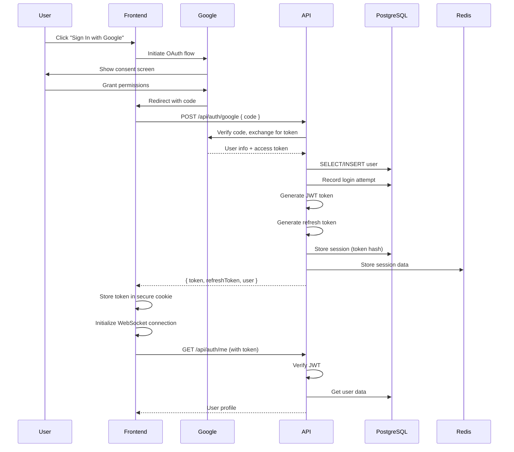
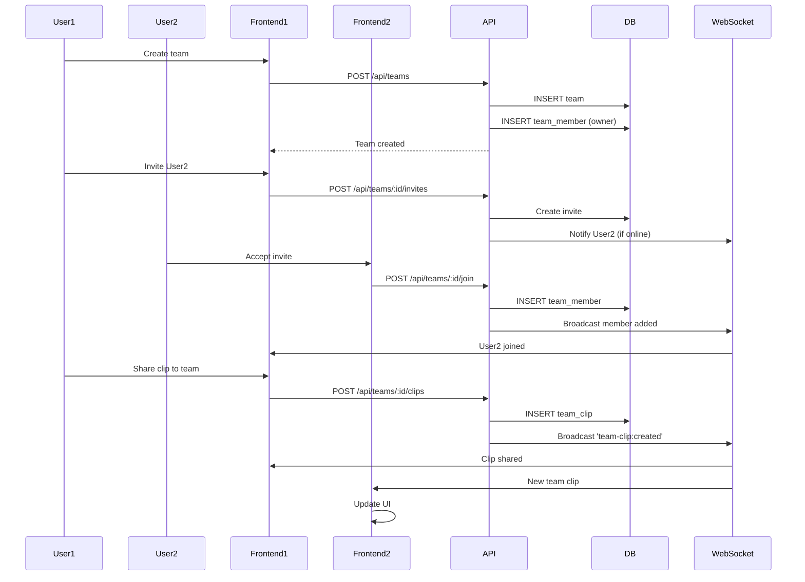
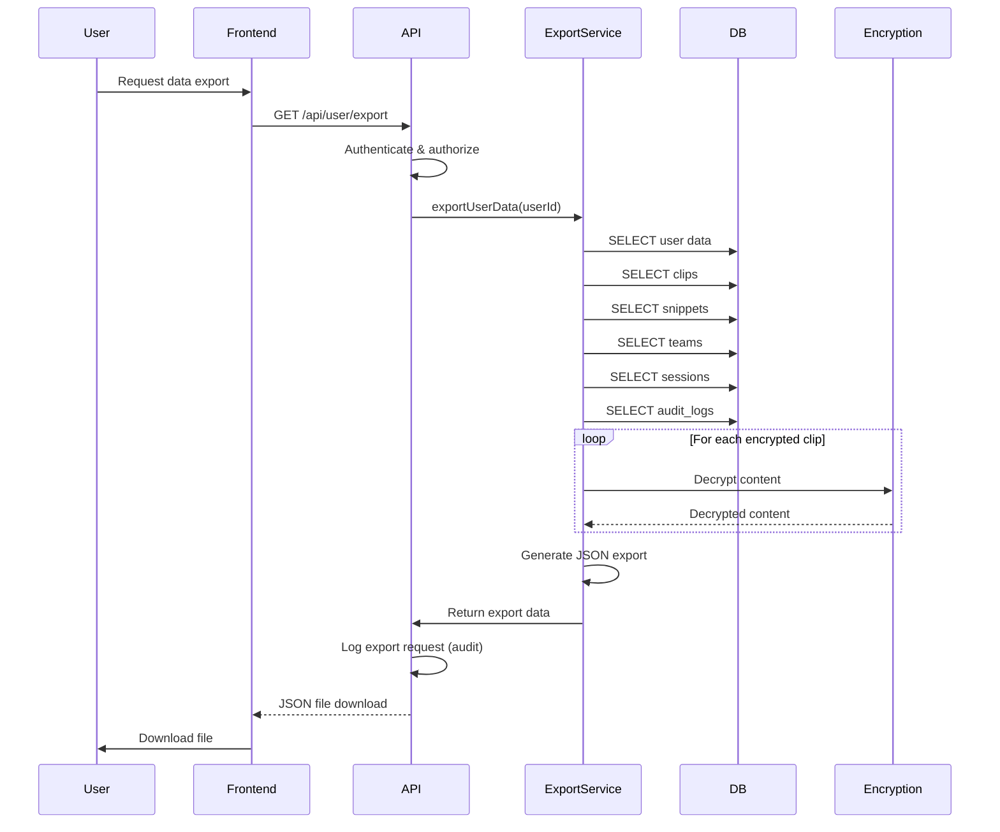
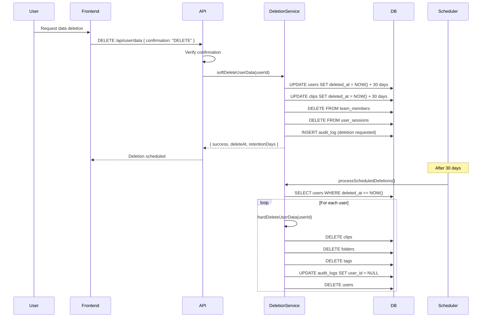

# ClipSync - Comprehensive System Overview & Architecture

## Executive Summary

ClipSync is a comprehensive, enterprise-grade clipboard management system designed for developers, teams, and power users. It provides real-time synchronization across devices, team collaboration features, advanced text transformations, and local AI integration, all while maintaining the highest standards of security and privacy.

### Key Statistics

- **Supported Platforms**: Web (React), Desktop (Windows, macOS, Linux), VS Code Extension
- **Concurrent Users**: Designed for 10,000+ concurrent users
- **Clip Capacity**: Unlimited clips per user (plan-dependent)
- **Team Size**: Up to 100 members per team (enterprise plan)
- **Real-time Sync**: <100ms latency for cross-device synchronization
- **API Response Time**: <200ms average (p95: <500ms)
- **Uptime SLA**: 99.9% availability target
- **Compliance**: GDPR-ready, SOC 2 preparation in progress

### Core Value Propositions

1. **Developer-First**: Built by developers, for developers - with tools that integrate seamlessly into workflows
2. **Privacy-First**: Local AI processing, optional cloud sync, end-to-end encryption
3. **Team Collaboration**: Real-time shared clipboards with granular permissions
4. **Enterprise Security**: Production-grade security with encryption, audit logging, and compliance features
5. **Multi-Platform**: Consistent experience across web, desktop, and IDE

---

## Table of Contents

1. [System Architecture](#system-architecture)
2. [Technology Stack](#technology-stack)
3. [Core Components Deep Dive](#core-components-deep-dive)
4. [Data Flow & Synchronization](#data-flow--synchronization)
5. [Security Architecture](#security-architecture)
6. [Database Schema](#database-schema)
7. [API Architecture](#api-architecture)
8. [Multi-Platform Support](#multi-platform-support)
9. [Performance & Scalability](#performance--scalability)
10. [Monitoring & Observability](#monitoring--observability)
11. [Deployment Architecture](#deployment-architecture)
12. [Development Workflow](#development-workflow)

---

## System Architecture

### High-Level Architecture

ClipSync follows a **modern microservices-oriented architecture** with clear separation of concerns:



### Architecture Principles

1. **Separation of Concerns**: Clear boundaries between presentation, business logic, and data layers
2. **Horizontal Scalability**: Stateless API servers enable easy horizontal scaling
3. **Security First**: Defense in depth with multiple security layers
4. **Privacy by Design**: Local-first architecture with optional cloud sync
5. **Developer Experience**: Hot reloading, comprehensive tooling, extensive documentation
6. **Resilience**: Graceful degradation, offline support, automatic retries
7. **Performance**: Multi-layer caching, connection pooling, query optimization

### Request Lifecycle



---

## Technology Stack

### Frontend Stack

| Technology | Purpose | Version | Rationale |
|------------|---------|---------|-----------|
| **React** | UI Framework | 18.3+ | Industry standard, excellent ecosystem, component reusability |
| **Vite** | Build Tool & Dev Server | 6.0+ | Fast HMR, optimized builds, modern ESM support |
| **Tailwind CSS** | Styling Framework | 3.4+ | Utility-first, rapid development, consistent design system |
| **Zustand** | State Management | 4.5+ | Lightweight, simple API, no boilerplate, excellent TypeScript support |
| **React Router** | Client-side Routing | 7.12+ | Declarative routing, code splitting support |
| **Lucide React** | Icon Library | Latest | Modern, consistent icon set, tree-shakeable |
| **Socket.IO Client** | Real-time Communication | 4.8+ | Reliable WebSocket abstraction, automatic reconnection |
| **IndexedDB** | Client-side Storage | Native | Large storage capacity, async API, offline support |
| **Workbox** | Service Worker | Latest | Offline caching, background sync, push notifications |

### UI/UX & Design Philosophy

The application has undergone a major design overhaul to move away from generic "AI-generated" interfaces to a more **organic, human-crafted aesthetic**.

**Themes**:
- **Retro Earth** (Default): Warm, organic tones (Sandy Brown, Rich Mahogany, Blue Slate, Beige) evoking a retro-modern feel.
- **Ethereal Aurora**: Cool, vibrant gradients for a digital-native look.

**Design Principles**:
- **Glassmorphism**: Extensive use of blur, transparency, and layered depth.
- **Organic Feel**: Asymmetry, textured backgrounds, and playful micro-interactions.
- **Premium Animations**: Fluid transitions, hover effects, and skeleton loaders.
- **Human-Centric Copy**: Conversational and friendly tone rather than robotic system messages.

### Visual Architecture

The visual system is engineered to deliver a consistent, premium experience through a strict hierarchy of tokens and components.



### Backend Stack

| Technology | Purpose | Version | Rationale |
|------------|---------|---------|-----------|
| **Node.js** | Runtime Environment | 18+ LTS | Non-blocking I/O, excellent for real-time apps, large ecosystem |
| **Express.js** | Web Framework | 4.18+ | Minimal, flexible, extensive middleware ecosystem |
| **PostgreSQL** | Primary Database | 14+ | ACID compliance, JSONB support, advanced features (RLS, full-text search) |
| **Redis** | Caching & Pub/Sub | 7+ | In-memory performance, pub/sub for real-time, rate limiting |
| **Socket.IO** | WebSocket Server | 4.8+ | Real-time bidirectional communication, room management |
| **JWT** | Authentication Tokens | 9.0+ | Stateless authentication, industry standard |
| **bcrypt** | Password Hashing | 5.1+ | Secure password hashing, configurable cost factor |
| **Helmet** | Security Headers | 7.1+ | Sets security headers, prevents common vulnerabilities |
| **morgan** | HTTP Logging | 1.10+ | Request logging middleware, configurable formats |
| **Bull** | Job Queue | 4.12+ | Redis-based job queue, reliable job processing |
| **crypto** | Encryption | Native | Node.js built-in, AES-256-GCM encryption |

### Mobile Stack

| Technology | Purpose | Version | Rationale |
|------------|---------|---------|-----------|
| **React Native** | Mobile Framework | 0.81+ | Native rendering with React, cross-platform |
| **Expo** | Development Platform | 54+ | Rapid development, OTA updates, easy build system |
| **React** | UI Engine | 19.1+ | Latest React features for mobile |
| **Expo Clipboard** | Clipboard Access | 5.0+ | Native clipboard integration |
| **@react-navigation**| Navigation | 6.x | Standard navigation library for RN |
| **Urql** | GraphQL/API | 6.x | Lightweight GraphQL/API client |

### Infrastructure & DevOps


| Technology | Purpose | Version | Rationale |
|------------|---------|---------|-----------|
| **Docker** | Containerization | Latest | Consistent environments, easy deployment |
| **Docker Compose** | Multi-container Orchestration | Latest | Local development, service orchestration |
| **Nginx** | Reverse Proxy & Load Balancer | 1.24+ | High performance, SSL termination, load balancing |
| **Git** | Version Control | Latest | Source control, collaboration |
| **Electron** | Desktop Framework | 28.1+ | Cross-platform desktop apps, web technologies |
| **Electron Builder** | Desktop Packaging | 24.9+ | Multi-platform builds, code signing, auto-updates |

### Performance Characteristics

- **Frontend Bundle Size**: ~500KB gzipped (initial load)
- **API Response Time**: <200ms average, <500ms p95
- **WebSocket Latency**: <50ms for real-time updates
- **Database Query Time**: <100ms average for indexed queries
- **Cache Hit Rate**: >80% for frequently accessed data
- **Concurrent Connections**: 10,000+ WebSocket connections per server

---

## Core Components Deep Dive

### 1. Web Application (`clipsync-app/`)

#### Purpose
Modern React-based single-page application providing the primary user interface for clipboard management, team collaboration, and developer tools.

#### Component Architecture

```
clipsync-app/src/
├── components/
│   ├── ui/                    # Reusable UI components
│   │   ├── Button.jsx
│   │   ├── Input.jsx
│   │   ├── Modal.jsx
│   │   ├── Toast.jsx
│   │   ├── Card.jsx
│   │   └── Badge.jsx
│   ├── Navigation.jsx         # Main navigation bar
│   ├── FilterBar.jsx          # Search and filter controls
│   ├── ClipList.jsx            # Main clip list view
│   ├── ClipCard.jsx            # Individual clip card
│   ├── DetailSidebar.jsx      # Clip detail view
│   ├── CommandPalette.jsx     # Ctrl+K command palette
│   ├── TransformPanel.jsx      # Text transformation panel
│   ├── SnippetLibrary.jsx     # Snippet management
│   ├── TeamsListScreen.jsx    # Team list view
│   ├── TeamSpaceScreen.jsx    # Team workspace
│   ├── SettingsScreen.jsx    # User settings
│   ├── DevTools.jsx           # Developer tools
│   ├── GitHelper.jsx          # Git utilities
│   ├── WorkflowAutomation.jsx # Workflow automation
│   └── StatsDashboard.jsx    # Analytics dashboard
├── services/
│   ├── api.js                 # REST API client
│   ├── websocket.js           # WebSocket client
│   └── ollama.js              # Local AI integration
├── store/
│   ├── useAuthStore.js        # Authentication state
│   ├── useClipStore.js        # Clipboard state
│   └── useTeamStore.js        # Team collaboration state
├── utils/
│   ├── clipboard.js           # Clipboard utilities
│   ├── typeDetection.js       # Content type detection
│   ├── transforms.js          # Text transformations
│   ├── advancedTransforms.js  # Advanced transformations
│   ├── storage.js             # IndexedDB wrapper
│   └── autoCategorize.js      # Auto-categorization
├── App.jsx                     # Main application component
└── main.jsx                    # Application entry point
```

#### State Management (Zustand)

**Auth Store** (`store/useAuthStore.js`):
- User profile data
- Authentication status
- JWT token management
- Device information
- Plan/subscription status

**Clip Store** (`store/useClipStore.js`):
- Clip collection (array)
- Selected clip
- Search query and filters
- Active tab (history, snippets, teams)
- Sync status
- UI preferences (compact mode, incognito mode)

**Team Store** (`store/useTeamStore.js`):
- Team list
- Active team
- Team clips
- Team members
- Team permissions

#### Service Layer

**API Client** (`services/api.js`):
- RESTful API communication
- Automatic token refresh
- Request/response interceptors
- Error handling and retries
- Request cancellation

**WebSocket Client** (`services/websocket.js`):
- Real-time connection management
- Automatic reconnection
- Event subscription system
- Device registration
- Room management for teams

**Ollama Client** (`services/ollama.js`):
- Local AI model communication
- Content categorization
- Duplicate detection
- Content summarization
- Privacy-first (no cloud data)

#### Routing Structure

- `/` - Landing page (unauthenticated) or History (authenticated)
- `/history` - Clipboard history
- `/snippets` - Snippet library
- `/teams` - Team list
- `/teams/:id` - Team workspace
- `/settings` - User settings
- `/dev-tools` - Developer tools
- `/stats` - Analytics dashboard

#### Performance Optimizations

1. **Code Splitting**: React.lazy() for route-based splitting
2. **Memoization**: React.memo() for expensive components
3. **Virtual Scrolling**: For large clip lists (1000+ items)
4. **Debouncing**: Search input debounced to 300ms
5. **Throttling**: Clipboard monitoring throttled to 500ms
6. **Service Worker**: Offline caching, background sync
7. **IndexedDB**: Local storage for offline access
8. **Image Optimization**: Lazy loading, WebP format

#### Offline Support

- **Service Worker**: Caches static assets and API responses
- **IndexedDB**: Stores clips locally for offline access
- **Queue System**: Queues API requests when offline, syncs on reconnect
- **Offline Indicator**: Visual indicator when offline
- **Background Sync**: Syncs queued operations when connection restored

### 2. Backend API Server (`backend/`)

#### Purpose
RESTful API server handling all business logic, data persistence, authentication, authorization, and real-time communication.

#### Directory Structure

```
backend/
├── config/
│   ├── database.js            # PostgreSQL connection pool
│   ├── redis.js               # Redis client configuration
│   └── secrets.js             # Secret management
├── routes/
│   ├── auth.js                # Authentication endpoints
│   ├── auth2fa.js             # Two-factor authentication
│   ├── clips.js                # Clip CRUD operations
│   ├── teams.js                # Team management
│   ├── teamClips.js            # Team clip operations
│   ├── shares.js               # Share link management
│   ├── tags.js                 # Tag management
│   ├── folders.js              # Folder organization
│   ├── devices.js              # Device management
│   └── user.js                 # User data export/deletion (GDPR)
├── middleware/
│   ├── auth.js                 # JWT authentication
│   ├── validation.js           # Input validation
│   ├── sanitization.js         # Input sanitization
│   ├── audit.js                # Audit logging
│   ├── waf.js                  # Web Application Firewall
│   ├── ddosProtection.js       # DDoS protection
│   ├── securityMonitoring.js   # Security monitoring
│   ├── sensitiveDataAudit.js   # Sensitive data access audit
│   ├── cacheMiddleware.js      # Response caching
│   ├── metrics.js              # Metrics collection
│   ├── apiSecurity.js          # API security utilities
│   ├── encryptionMiddleware.js # Encryption handling
│   └── rlsMiddleware.js        # Row-level security
├── services/
│   ├── cache.js                # Redis caching service
│   ├── monitoring.js           # System monitoring
│   ├── dataExport.js           # GDPR data export
│   ├── dataDeletion.js         # GDPR data deletion
│   ├── pubsub.js               # Redis Pub/Sub
│   ├── rateLimiter.js          # Rate limiting service
│   ├── securityAlerts.js       # Security alerting
│   └── sessionStore.js         # Session management
├── utils/
│   ├── encryption.js           # AES-256-GCM encryption
│   ├── keyRotation.js          # Encryption key rotation
│   ├── sensitiveDataDetector.js # Sensitive data detection
│   ├── categorizer.js          # Auto-categorization
│   ├── logger.js               # Structured logging with PII masking
│   ├── deviceManagement.js     # Device management utilities
│   └── tokenRotation.js        # Token rotation
├── jobs/
│   ├── queue.js                # Bull job queue setup
│   └── tasks/
│       ├── analytics.js        # Analytics processing
│       └── reports.js           # Report generation
├── db/
│   ├── schema.sql              # Database schema
│   └── migrations/
│       └── add_rls_policies.sql # Row-level security policies
└── server.js                   # Application entry point
```

#### API Routes (Complete Listing)

**Authentication** (`/api/auth/*`):
- `POST /api/auth/google` - Google OAuth authentication
- `POST /api/auth/refresh` - Refresh JWT token
- `POST /api/auth/logout` - Logout and invalidate session
- `GET /api/auth/me` - Get current user profile
- `DELETE /api/auth/account` - Delete user account

**Two-Factor Authentication** (`/api/auth/2fa/*`):
- `POST /api/auth/2fa/setup` - Setup 2FA
- `POST /api/auth/2fa/verify` - Verify 2FA code
- `POST /api/auth/2fa/disable` - Disable 2FA

**Clips** (`/api/clips/*`):
- `GET /api/clips` - List clips (with pagination, filters)
- `GET /api/clips/:id` - Get specific clip
- `POST /api/clips` - Create new clip
- `PUT /api/clips/:id` - Update clip
- `DELETE /api/clips/:id` - Delete clip
- `POST /api/clips/:id/pin` - Pin/unpin clip
- `POST /api/clips/:id/copy` - Increment copy count

**Teams** (`/api/teams/*`):
- `GET /api/teams` - List user's teams
- `POST /api/teams` - Create team
- `GET /api/teams/:id` - Get team details
- `PUT /api/teams/:id` - Update team
- `DELETE /api/teams/:id` - Delete team
- `POST /api/teams/:id/invites` - Invite members
- `POST /api/teams/:id/join` - Join team
- `DELETE /api/teams/:id/members/:userId` - Remove member

**Team Clips** (`/api/teams/:teamId/clips/*`):
- `GET /api/teams/:teamId/clips` - List team clips
- `POST /api/teams/:teamId/clips` - Share clip to team
- `PUT /api/teams/:teamId/clips/:id` - Update team clip
- `DELETE /api/teams/:teamId/clips/:id` - Delete team clip

**Shares** (`/api/shares/*`):
- `POST /api/shares` - Create share link
- `GET /api/shares/:token` - Access shared clip (public)
- `DELETE /api/shares/:id` - Delete share link

**Tags** (`/api/tags/*`):
- `GET /api/tags` - List user's tags
- `POST /api/tags` - Create tag
- `PUT /api/tags/:id` - Update tag
- `DELETE /api/tags/:id` - Delete tag

**Folders** (`/api/folders/*`):
- `GET /api/folders` - List folders
- `POST /api/folders` - Create folder
- `PUT /api/folders/:id` - Update folder
- `DELETE /api/folders/:id` - Delete folder

**Devices** (`/api/devices/*`):
- `GET /api/devices` - List user's devices
- `DELETE /api/devices/:id` - Revoke device
- `DELETE /api/devices` - Revoke all other devices

**User Data** (`/api/user/*`):
- `GET /api/user/export` - Export all user data (GDPR)
- `DELETE /api/user/data` - Request data deletion (GDPR)
- `POST /api/user/data/cancel` - Cancel deletion request

#### Middleware Pipeline

The middleware stack executes in the following order:

1. **Helmet** - Security headers (CSP, HSTS, X-Frame-Options, etc.)
2. **Compression** - Gzip compression for responses
3. **CORS** - Cross-origin resource sharing configuration
4. **Body Parser** - JSON and URL-encoded body parsing (10MB limit)
5. **Morgan** - HTTP request logging
6. **Request ID** - Generate unique request ID for tracing
7. **IP Blacklist Check** - Block blacklisted IPs
8. **DDoS Protection** - Rate limiting and request throttling
9. **WAF** - Web Application Firewall (SQL injection, XSS detection)
10. **Security Monitoring** - Anomaly detection, threat detection
11. **Request Validation** - Validate request format
12. **Request Size Validation** - Enforce 10MB limit
13. **Timeout Handler** - 30-second request timeout
14. **Rate Limiting** - General rate limiting (100 req/15min)
15. **Strict Rate Limiting** - Stricter limits for auth/shares
16. **Input Sanitization** - Sanitize all inputs
17. **Query Parameter Sanitization** - Sanitize query strings
18. **Response Caching** - Cache GET responses (5 minutes)
19. **Metrics Collection** - Collect performance metrics
20. **Route Handlers** - Execute route-specific logic
21. **Error Handler** - Global error handling

#### Service Layer Details

**Cache Service** (`services/cache.js`):
- Redis-based caching
- Cache key generation
- Cache invalidation by pattern
- User-specific cache invalidation
- Team-specific cache invalidation
- Cache statistics
- Cache warming strategies

**Monitoring Service** (`services/monitoring.js`):
- System health checks
- Database connection health
- Redis connection health
- Cache statistics
- Performance metrics
- Error rate tracking

**Data Export Service** (`services/dataExport.js`):
- Comprehensive user data export
- JSON format with all user data
- Includes clips, snippets, teams, sessions, audit logs
- Decrypts encrypted clips for export

**Data Deletion Service** (`services/dataDeletion.js`):
- Soft delete with 30-day retention
- Hard delete after retention period
- Cascade deletion of related data
- Audit log anonymization
- Scheduled deletion processing

**Pub/Sub Service** (`services/pubsub.js`):
- Redis Pub/Sub for real-time events
- Event publishing
- Multi-server support
- Event subscription management

#### Database Layer

**Connection Pooling**:
- Min connections: 10
- Max connections: 100
- Idle timeout: 30 seconds
- Connection timeout: 2 seconds
- Statement timeout: 30 seconds
- Query timeout: 30 seconds

**Query Patterns**:
- Parameterized queries (prevents SQL injection)
- Transaction support for multi-step operations
- Connection pooling for performance
- Prepared statements for frequently used queries

**Transaction Support**:
- Atomic operations for critical paths
- Rollback on errors
- Nested transaction support (savepoints)

### 3. Desktop Application (`clipsync-desktop/`)

#### Purpose
Electron-based desktop application providing native OS integration, system tray access, and global keyboard shortcuts.

#### Electron Architecture

**Main Process** (`main.js`):
- Application lifecycle management
- Window creation and management
- System tray integration
- Global keyboard shortcuts
- Clipboard monitoring
- Auto-update handling
- IPC (Inter-Process Communication) handlers

**Renderer Process**:
- React application (same as web app)
- UI rendering
- User interactions
- No Node.js access (security)

**Preload Script** (`preload.js`):
- Secure bridge between main and renderer
- Exposes safe IPC methods
- Context isolation enabled
- Node integration disabled

#### Platform-Specific Features

**Windows**:
- System tray with context menu
- Global shortcuts (Ctrl+Shift+V, C, H)
- Windows notifications
- Auto-start with Windows
- NSIS installer (.exe)
- Portable version (.exe)

**macOS**:
- Menu bar integration
- Global shortcuts (Cmd+Shift+V, C, H)
- macOS notifications
- DMG installer
- Code signing ready
- Notarization ready
- Entitlements for clipboard access

**Linux**:
- System tray (GTK/KDE)
- Global shortcuts
- Desktop notifications
- AppImage (portable)
- DEB package (Debian/Ubuntu)
- RPM package (Fedora/RHEL)
- Desktop entry file

#### Security Features

- **Context Isolation**: Enabled (renderer cannot access Node.js)
- **Node Integration**: Disabled in renderer
- **Preload Script**: Secure IPC bridge
- **Content Security Policy**: Enforced
- **No Remote Content**: All content loaded locally
- **Code Signing**: Ready for production signing

#### Auto-Update System

- **Update Server**: electron-updater integration
- **Update Check**: On startup and periodically
- **Background Download**: Downloads updates in background
- **Install on Quit**: Installs updates when app quits
- **Rollback**: Automatic rollback on update failure
- **Version Management**: Semantic versioning

### 4. VS Code Extension (`vscode-extension/`)

#### Purpose
VS Code extension providing clipboard management, snippet library, and developer tools directly within the IDE.

#### Extension Architecture

**Activation**:
- Activates on startup finished
- Lazy loading for performance
- Extension context management

**Components**:
- **ClipSyncPanel**: Modern webview UI
- **HistoryProvider**: Clipboard history tree view
- **SnippetProvider**: Snippet library tree view
- **TeamProvider**: Team clips tree view
- **ClipboardManager**: Clipboard monitoring and storage
- **SnippetManager**: Snippet CRUD operations
- **TeamManager**: Team collaboration
- **TransformManager**: Text transformations

#### Commands

- `clipsync.openPanel` - Open ClipSync panel (Ctrl+Shift+V)
- `clipsync.pasteFromHistory` - Paste from history (Ctrl+Shift+H)
- `clipsync.saveSnippet` - Save selection as snippet (Ctrl+Shift+S)
- `clipsync.insertSnippet` - Insert snippet
- `clipsync.formatCode` - Format code
- `clipsync.transformText` - Transform text (Ctrl+Shift+T)
- `clipsync.shareWithTeam` - Share with team
- `clipsync.generateCommit` - Generate commit message
- `clipsync.testRegex` - Test regex pattern
- `clipsync.compareText` - Compare text (diff)
- `clipsync.saveAsTemplate` - Save as template
- `clipsync.splitClip` - Split clip by delimiter
- `clipsync.pasteAsPlainText` - Paste as plain text

#### Webview System

**Modern UI**:
- React-like component structure
- VS Code theme integration
- Search and filter functionality
- Tab-based navigation (Clips, Snippets, Teams)
- Real-time updates via message passing

**Message Passing**:
- Extension → Webview: Data updates, commands
- Webview → Extension: User actions, requests
- Secure message channel
- Type-safe message handling

#### Tree Views

**History Provider**:
- Displays clipboard history
- Icons based on clip type
- Timestamps and metadata
- Context menu actions (copy, delete, pin)
- Click to paste

**Snippet Provider**:
- Displays snippet library
- Category grouping
- Syntax highlighting preview
- Quick insert
- Favorites indicator

**Team Provider**:
- Displays teams
- Team clips
- Member indicators
- Real-time sync indicators
- Share actions

---

### 5. Mobile Application (`clipsync-mobile/`)

#### Purpose
React Native application (via Expo) providing a native mobile experience for iOS and Android, focusing on seamless clipboard synchronization and quick access to clips on the go.

#### Component Architecture

**Core Stack**:
- **Expo SDK 54**: Provides a robust set of native APIs and development tools.
- **React Native 0.81**: The underlying framework for native rendering.
- **React 19.1**: Leveraging the latest React features and concurrent rendering.
- **Zustand**: Shared state management pattern with the web app.

**Key Features**:
- **Background Sync**: Keeps clipboard in sync even when the app is backgrounded (limited by OS constraints).
- **Share Sheet Integration**: Allows sharing content from other apps directly to ClipSync.
- **Biometric Auth**: FaceID/TouchID integration for secure access.
- **Offline Mode**: Full access to local clips without internet connection.
- **Push Notifications**: Real-time alerts for team updates and shared clips.

---

## Data Flow & Synchronization

### Clipboard Sync Flow (Detailed)



### Authentication Flow (Detailed)



### Team Collaboration Flow (Detailed)



### GDPR Data Export Flow



### GDPR Data Deletion Flow



---

## Security Architecture

### Authentication & Authorization

#### Authentication Methods

**Primary: Google OAuth 2.0**
- OAuth 2.0 flow with Google
- Token verification with Google API
- User profile retrieval
- Automatic account creation/update

**Two-Factor Authentication (2FA)**
- TOTP (Time-based One-Time Password)
- QR code generation for setup
- Backup codes generation
- Optional but recommended

**Session Management**
- JWT tokens (7-day expiration)
- Refresh tokens (30-day expiration)
- Token rotation on refresh
- Device fingerprinting
- Concurrent session limits
- Session revocation

#### Token Structure

**JWT Payload**:
```json
{
  "userId": "uuid",
  "deviceFingerprint": "hash",
  "iat": 1234567890,
  "exp": 1234567890
}
```

**Token Storage**:
- HTTP-only cookies (secure, SameSite=Strict)
- Not accessible via JavaScript (XSS protection)
- Automatic inclusion in requests
- Secure flag in production (HTTPS only)

#### Authorization

**Role-Based Access Control (RBAC)**:
- **Owner**: Full control (create, read, update, delete)
- **Admin**: Manage members, update team settings
- **Editor**: Create, update, delete clips
- **Viewer**: Read-only access

**Resource-Level Permissions**:
- Users can only access their own clips
- Team members can access team clips based on role
- Share links have configurable permissions
- Row-level security enforces at database level

### Data Encryption

#### Encryption at Rest

**Algorithm**: AES-256-GCM (Galois/Counter Mode)
- 256-bit key length
- Authenticated encryption
- IV (Initialization Vector): 16 bytes, random per encryption
- Auth Tag: 16 bytes for integrity verification

**Key Management**:
- Master encryption key: 64-character hex string (32 bytes)
- Stored in environment variable: `ENCRYPTION_KEY`
- Production enforcement: Fails startup if not set
- Key rotation: Supported with migration script

**Encryption Format**:
```
{iv}:{authTag}:{encryptedData}
```
All components hex-encoded.

**Sensitive Data Detection**:
- Automatic detection of passwords, API keys, tokens
- Patterns for AWS credentials, database URLs, OAuth secrets
- Confidence scoring (0.0 - 1.0)
- Automatic encryption trigger for high-confidence detections

#### Encryption in Transit

**TLS/SSL**:
- TLS 1.3 enforced in production
- HTTPS for all HTTP traffic
- WSS (WebSocket Secure) for WebSocket connections
- Certificate management via Let's Encrypt or commercial CA

**Certificate Pinning** (Optional):
- Mobile apps can pin certificates
- Prevents MITM attacks
- Certificate rotation strategy

#### Key Rotation Process

1. **Generate New Key**:
   ```bash
   node -e "console.log(require('crypto').randomBytes(32).toString('hex'))"
   ```

2. **Set New Key**: Update `ENCRYPTION_KEY` environment variable

3. **Run Migration**:
   ```javascript
   import { migrateToNewKey } from './utils/keyRotation.js';
   await migrateToNewKey(oldKeyHex, newKeyHex);
   ```

4. **Restart Application**: New key takes effect

5. **Monitor**: Check logs for rotation errors

**Migration Strategy**:
- Batch processing (100 clips per batch)
- Decrypt with old key
- Re-encrypt with new key
- Update database
- Error handling and retry logic
- Audit logging of rotation process

### PII Protection

#### PII Masking in Logs

**Masked Fields**:
- Email addresses: `user@domain.com` → `u***@d***.com`
- IP addresses: `192.168.1.1` → `192.168.*.*`
- Names: `John Doe` → `J*** D***`
- Phone numbers: `+1234567890` → `+1***-***-7890`
- Generic fields: `value123` → `va***23`

**Implementation**:
- Automatic masking in logger (`utils/logger.js`)
- Audit log masking before storage
- Recursive masking for nested objects
- String masking for log messages

#### Audit Log Sanitization

- All audit logs mask PII before storage
- IP addresses partially masked
- User agents truncated
- Metadata sanitized
- Retention: 90 days for user-specific logs, 1 year for security events

### GDPR Compliance

#### Right to Access (Data Export)

**Endpoint**: `GET /api/user/export`

**Export Includes**:
- User profile information
- All clips (decrypted if encrypted)
- Folders and organization
- Tags
- Team memberships
- Team clips
- Share links created
- Active sessions
- Audit logs (last 90 days)

**Format**: JSON file
**Size Limit**: No limit (streamed for large exports)
**Processing Time**: <30 seconds for typical user

#### Right to Erasure (Data Deletion)

**Endpoint**: `DELETE /api/user/data`

**Process**:
1. **Soft Delete**: Mark for deletion with 30-day retention
2. **Grace Period**: User can cancel within 30 days
3. **Hard Delete**: Permanent deletion after retention period
4. **Cascade**: All related data deleted
5. **Anonymization**: Audit logs anonymized (not deleted for compliance)

**Retention Period**: 30 days
**Cancellation**: `POST /api/user/data/cancel`

#### Data Minimization

- Only collect necessary data
- No tracking pixels or analytics cookies
- Local AI processing (no cloud data)
- Optional cloud sync (user choice)
- Minimal metadata collection

### Row-Level Security (RLS)

PostgreSQL Row-Level Security policies ensure users can only access their own data:

**Policies Implemented**:
- `clips_user_isolation`: Users can only see their own clips
- `folders_user_isolation`: Users can only see their own folders
- `tags_user_isolation`: Users can only see their own tags
- `shares_user_isolation`: Users can only see their own shares
- `sessions_user_isolation`: Users can only see their own sessions
- `team_clips_member_access`: Users can only see team clips from teams they're members of
- `teams_member_access`: Users can only see teams they're members of

**Implementation**:
- Uses PostgreSQL session variables: `app.current_user_id`
- Set via middleware before queries
- Enforced at database level (cannot be bypassed)
- Applies to all SELECT, INSERT, UPDATE, DELETE operations

### Security Monitoring

#### Threat Detection

**Anomaly Detection**:
- Unusual access patterns
- Rapid API calls
- Multiple failed login attempts
- Access from new locations
- Unusual clip access patterns

**Security Alerts**:
- Email notifications for security events
- Webhook support for SIEM integration
- Real-time alerting for critical threats
- Alert aggregation to prevent spam

#### Audit Logging

**Logged Events**:
- All authentication attempts (success/failure)
- All clip operations (create, read, update, delete)
- All team operations
- All share link access
- All encrypted clip access
- All decryption events
- All security events
- All GDPR data exports/deletions

**Log Retention**:
- User-specific logs: 90 days
- Security events: 1 year
- Compliance logs: 7 years (if required)

**Log Analysis**:
- Searchable by user, action, resource type
- Filterable by date range, IP address
- Exportable for compliance audits

### Web Application Firewall (WAF)

**Protection Against**:
- SQL Injection: Pattern detection, parameterized queries
- XSS (Cross-Site Scripting): Input sanitization, output encoding
- Command Injection: Command pattern detection
- Path Traversal: Path validation
- CSRF: SameSite cookies, CSRF tokens

**WAF Rules**:
- Pattern matching for known attack vectors
- Rate limiting per IP
- IP reputation checking
- Request fingerprinting
- Bot detection

### DDoS Protection

**Rate Limiting**:
- General: 100 requests per 15 minutes per IP
- Strict: 20 requests per 15 minutes for auth/shares
- Per-user limits: 1000 requests per hour
- Burst protection: Sliding window algorithm

**IP Blocking**:
- Temporary blocks: 1 hour for rate limit violations
- Permanent blocks: Manual for known bad actors
- IP whitelist: For trusted sources
- IP blacklist: For known threats

**Request Throttling**:
- Automatic throttling of excessive requests
- Queue system for legitimate high-volume users
- Request fingerprinting for bot detection

---

## Database Schema

### Complete Schema Overview

#### Core Tables

**users**
```sql
- id: UUID (Primary Key)
- google_id: VARCHAR(255) UNIQUE
- email: VARCHAR(255) UNIQUE
- name: VARCHAR(255)
- picture: TEXT
- plan: VARCHAR(50) DEFAULT 'free'
- failed_login_attempts: INTEGER DEFAULT 0
- account_locked_until: TIMESTAMP NULL
- two_factor_enabled: BOOLEAN DEFAULT FALSE
- two_factor_secret: VARCHAR(255) NULL
- created_at: TIMESTAMP
- updated_at: TIMESTAMP
- last_login: TIMESTAMP
```

**clips**
```sql
- id: UUID (Primary Key)
- user_id: UUID (Foreign Key → users.id)
- content: TEXT NOT NULL
- type: VARCHAR(50) NOT NULL
- encrypted: BOOLEAN DEFAULT FALSE
- pinned: BOOLEAN DEFAULT FALSE
- folder_id: UUID (Foreign Key → folders.id)
- metadata: JSONB
- auto_categorized: BOOLEAN DEFAULT FALSE
- category_confidence: DECIMAL(3,2)
- template: BOOLEAN DEFAULT FALSE
- template_placeholders: JSONB
- expires_at: TIMESTAMP NULL
- created_at: TIMESTAMP
- updated_at: TIMESTAMP
- deleted_at: TIMESTAMP NULL
```

**teams**
```sql
- id: UUID (Primary Key)
- name: VARCHAR(255) NOT NULL
- owner_id: UUID (Foreign Key → users.id)
- plan: VARCHAR(50) DEFAULT 'team'
- created_at: TIMESTAMP
- updated_at: TIMESTAMP
```

**team_members**
```sql
- id: UUID (Primary Key)
- team_id: UUID (Foreign Key → teams.id)
- user_id: UUID (Foreign Key → users.id)
- role: VARCHAR(50) DEFAULT 'member'
- joined_at: TIMESTAMP
- UNIQUE(team_id, user_id)
```

**team_clips**
```sql
- id: UUID (Primary Key)
- team_id: UUID (Foreign Key → teams.id)
- user_id: UUID (Foreign Key → users.id)
- content: TEXT NOT NULL
- type: VARCHAR(50) NOT NULL
- encrypted: BOOLEAN DEFAULT FALSE
- metadata: JSONB
- expires_at: TIMESTAMP NULL
- created_at: TIMESTAMP
- updated_at: TIMESTAMP
- deleted_at: TIMESTAMP NULL
```

**share_links**
```sql
- id: VARCHAR(12) (Primary Key, nanoid)
- clip_id: UUID (Foreign Key → clips.id)
- team_clip_id: UUID (Foreign Key → team_clips.id)
- user_id: UUID (Foreign Key → users.id)
- content: TEXT NOT NULL
- type: VARCHAR(50) NOT NULL
- password_hash: VARCHAR(255) NULL
- expires_at: TIMESTAMP NULL
- max_views: INTEGER NULL
- view_count: INTEGER DEFAULT 0
- one_time: BOOLEAN DEFAULT FALSE
- created_at: TIMESTAMP
- accessed_at: TIMESTAMP NULL
```

**tags**
```sql
- id: UUID (Primary Key)
- user_id: UUID (Foreign Key → users.id)
- name: VARCHAR(100) NOT NULL
- color: VARCHAR(7)
- created_at: TIMESTAMP
- UNIQUE(user_id, name)
```

**folders**
```sql
- id: UUID (Primary Key)
- user_id: UUID (Foreign Key → users.id)
- name: VARCHAR(255) NOT NULL
- color: VARCHAR(7)
- icon: VARCHAR(50)
- position: INTEGER DEFAULT 0
- parent_id: UUID (Foreign Key → folders.id)
- created_at: TIMESTAMP
- updated_at: TIMESTAMP
```

**devices**
```sql
- id: UUID (Primary Key)
- user_id: UUID (Foreign Key → users.id)
- device_name: VARCHAR(255) NOT NULL
- device_type: VARCHAR(50)
- user_agent: TEXT
- device_fingerprint: VARCHAR(255)
- last_sync: TIMESTAMP
- created_at: TIMESTAMP
- UNIQUE(user_id, device_name)
```

**user_sessions**
```sql
- id: UUID (Primary Key)
- user_id: UUID (Foreign Key → users.id)
- token_hash: VARCHAR(255) NOT NULL
- refresh_token_hash: VARCHAR(255)
- device_fingerprint: VARCHAR(255)
- ip_address: VARCHAR(45)
- user_agent: TEXT
- expires_at: TIMESTAMP NOT NULL
- created_at: TIMESTAMP
- last_used_at: TIMESTAMP
```

**audit_logs**
```sql
- id: UUID (Primary Key)
- user_id: UUID (Foreign Key → users.id, NULL for system events)
- team_id: UUID (Foreign Key → teams.id, NULL)
- action: VARCHAR(100) NOT NULL
- resource_type: VARCHAR(50)
- resource_id: UUID
- metadata: JSONB
- ip_address: VARCHAR(45)
- user_agent: TEXT
- created_at: TIMESTAMP
```

**login_attempts**
```sql
- id: UUID (Primary Key)
- user_id: UUID (Foreign Key → users.id, NULL for failed attempts)
- email: VARCHAR(255) NOT NULL
- ip_address: VARCHAR(45) NOT NULL
- user_agent: TEXT
- success: BOOLEAN DEFAULT FALSE
- failure_reason: VARCHAR(255)
- created_at: TIMESTAMP
```

### Indexes

**Performance Indexes**:
- `idx_clips_user_id` - Fast user clip queries
- `idx_clips_created_at` - Chronological sorting
- `idx_clips_type` - Type filtering
- `idx_clips_pinned` - Pinned clips (partial index)
- `idx_clips_deleted_at` - Soft delete filtering (partial index)
- `idx_team_clips_team_id` - Team clip queries
- `idx_team_members_team_id` - Team member lookups
- `idx_team_members_user_id` - User team lookups
- `idx_share_links_expires_at` - Expired link cleanup
- `idx_devices_user_id` - Device management
- `idx_audit_logs_user_id` - User audit queries
- `idx_audit_logs_created_at` - Time-based audit queries
- `idx_audit_logs_action` - Action-based queries
- `idx_login_attempts_ip_address` - Security monitoring

### Constraints

**Foreign Keys**:
- All `user_id` columns reference `users(id) ON DELETE CASCADE`
- All `team_id` columns reference `teams(id) ON DELETE CASCADE`
- `folder_id` references `folders(id) ON DELETE SET NULL`
- Cascade deletes ensure data consistency

**Unique Constraints**:
- `users.email` - Unique email addresses
- `users.google_id` - Unique Google IDs
- `tags(user_id, name)` - Unique tag names per user
- `categories(user_id, name)` - Unique category names per user
- `team_members(team_id, user_id)` - Unique team membership
- `devices(user_id, device_name)` - Unique device names per user

**Check Constraints**:
- `share_links`: Either `clip_id` or `team_clip_id` must be set
- Plan values: Must be one of ('free', 'pro', 'team', 'enterprise')
- Role values: Must be one of ('owner', 'admin', 'editor', 'viewer')

### Triggers

**Automatic Timestamp Updates**:
- `update_users_updated_at` - Updates `updated_at` on user changes
- `update_clips_updated_at` - Updates `updated_at` on clip changes
- `update_folders_updated_at` - Updates `updated_at` on folder changes
- `update_teams_updated_at` - Updates `updated_at` on team changes
- `update_team_clips_updated_at` - Updates `updated_at` on team clip changes
- `update_categories_updated_at` - Updates `updated_at` on category changes
- `update_subscriptions_updated_at` - Updates `updated_at` on subscription changes

### Relationships

**One-to-Many**:
- User → Clips (1:N)
- User → Folders (1:N)
- User → Tags (1:N)
- User → Devices (1:N)
- User → Sessions (1:N)
- Team → Team Clips (1:N)
- Folder → Clips (1:N, via folder_id)

**Many-to-Many**:
- Users ↔ Teams (via team_members)
- Clips ↔ Tags (via clip_tags)
- Clips ↔ Categories (via clip_categories)

**Self-Referencing**:
- Folders → Folders (parent_id for nested folders)

---

## API Architecture

### RESTful API Design

**Base URL**:
- Development: `http://localhost:3001/api`
- Production: `https://api.clipsync.com/api`

**Authentication**:
- Method: Bearer token in `Authorization` header
- Format: `Authorization: Bearer <JWT_TOKEN>`
- Token expiration: 7 days
- Refresh token: 30 days

### Complete API Reference

#### Authentication Endpoints

**POST /api/auth/google**
- **Purpose**: Authenticate with Google OAuth
- **Request Body**: `{ code: string }`
- **Response**: `{ token: string, refreshToken: string, user: User }`
- **Rate Limit**: 10 requests per 15 minutes

**POST /api/auth/refresh**
- **Purpose**: Refresh JWT token
- **Request Body**: `{ refreshToken: string }`
- **Response**: `{ token: string }`
- **Rate Limit**: 20 requests per 15 minutes

**POST /api/auth/logout**
- **Purpose**: Logout and invalidate session
- **Response**: `{ success: true }`
- **Side Effects**: Deletes session from database and Redis

**GET /api/auth/me**
- **Purpose**: Get current user profile
- **Response**: `{ user: User }`
- **Cached**: Yes (5 minutes)

#### Clip Endpoints

**GET /api/clips**
- **Purpose**: List user's clips
- **Query Parameters**:
  - `limit`: Number of results (default: 100, max: 1000)
  - `offset`: Pagination offset (default: 0)
  - `type`: Filter by type ('text', 'code', 'json', etc.)
  - `pinned`: Filter pinned clips (true/false)
  - `search`: Search query
  - `folderId`: Filter by folder
  - `tags`: Comma-separated tag names
- **Response**: `{ clips: Clip[], total: number, hasMore: boolean }`
- **Cached**: Yes (5 minutes, invalidated on write)

**GET /api/clips/:id**
- **Purpose**: Get specific clip
- **Response**: `{ clip: Clip }`
- **Special**: Decrypts if encrypted
- **Audit**: Logs access to encrypted clips
- **Cached**: Yes (5 minutes)

**POST /api/clips**
- **Purpose**: Create new clip
- **Request Body**:
  ```json
  {
    "content": "string",
    "type": "string",
    "pinned": false,
    "folderId": "uuid",
    "tags": ["string"],
    "encrypt": false,
    "metadata": {},
    "template": false,
    "expiresInMinutes": null
  }
  ```
- **Response**: `{ clip: Clip }`
- **Side Effects**: 
  - Auto-categorizes content
  - Detects sensitive data
  - Encrypts if sensitive or requested
  - Invalidates cache
  - Publishes WebSocket event

**PUT /api/clips/:id**
- **Purpose**: Update clip
- **Request Body**: Partial clip object
- **Response**: `{ clip: Clip }`
- **Side Effects**: Invalidates cache, publishes WebSocket event

**DELETE /api/clips/:id**
- **Purpose**: Delete clip (soft delete)
- **Response**: `{ success: true }`
- **Side Effects**: Sets `deleted_at`, invalidates cache, publishes WebSocket event

**POST /api/clips/:id/pin**
- **Purpose**: Pin or unpin clip
- **Response**: `{ clip: Clip }`

**POST /api/clips/:id/copy**
- **Purpose**: Increment copy count
- **Response**: `{ clip: Clip }`

#### Team Endpoints

**GET /api/teams**
- **Purpose**: List user's teams
- **Response**: `{ teams: Team[] }`

**POST /api/teams**
- **Purpose**: Create team
- **Request Body**: `{ name: string }`
- **Response**: `{ team: Team }`
- **Requires**: Pro plan or higher

**GET /api/teams/:id**
- **Purpose**: Get team details
- **Response**: `{ team: Team, members: Member[], clips: Clip[] }`

**PUT /api/teams/:id**
- **Purpose**: Update team
- **Requires**: Owner or Admin role
- **Request Body**: `{ name: string }`
- **Response**: `{ team: Team }`

**DELETE /api/teams/:id**
- **Purpose**: Delete team
- **Requires**: Owner role
- **Response**: `{ success: true }`
- **Side Effects**: Cascade deletes all team clips and members

**POST /api/teams/:id/invites**
- **Purpose**: Invite members to team
- **Requires**: Owner or Admin role
- **Request Body**: `{ emails: string[] }`
- **Response**: `{ invites: Invite[] }`

**POST /api/teams/:id/join**
- **Purpose**: Join team (accept invite)
- **Response**: `{ team: Team, role: string }`

**DELETE /api/teams/:id/members/:userId**
- **Purpose**: Remove team member
- **Requires**: Owner or Admin role
- **Response**: `{ success: true }`

#### Team Clip Endpoints

**GET /api/teams/:teamId/clips**
- **Purpose**: List team clips
- **Response**: `{ clips: TeamClip[] }`

**POST /api/teams/:teamId/clips**
- **Purpose**: Share clip to team
- **Request Body**: `{ content: string, type: string }`
- **Response**: `{ clip: TeamClip }`
- **Side Effects**: Publishes WebSocket event to all team members

**PUT /api/teams/:teamId/clips/:id**
- **Purpose**: Update team clip
- **Requires**: Editor role or higher
- **Response**: `{ clip: TeamClip }`

**DELETE /api/teams/:teamId/clips/:id**
- **Purpose**: Delete team clip
- **Requires**: Editor role or higher
- **Response**: `{ success: true }`

#### Share Link Endpoints

**POST /api/shares**
- **Purpose**: Create share link
- **Request Body**:
  ```json
  {
    "clipId": "uuid",
    "password": "string",
    "expiresInHours": 24,
    "maxViews": 10,
    "oneTime": false
  }
  ```
- **Response**: `{ share: Share, url: string }`

**GET /api/shares/:token**
- **Purpose**: Access shared clip (public, no auth required)
- **Response**: `{ content: string, type: string }`
- **Side Effects**: Increments view count, checks expiration

**DELETE /api/shares/:id**
- **Purpose**: Delete share link
- **Response**: `{ success: true }`

#### User Data Endpoints (GDPR)

**GET /api/user/export**
- **Purpose**: Export all user data (GDPR right to access)
- **Response**: JSON file download
- **Audit**: Logs export request

**DELETE /api/user/data**
- **Purpose**: Request data deletion (GDPR right to erasure)
- **Request Body**: `{ confirmation: "DELETE" }`
- **Response**: `{ success: true, deleteAt: timestamp, retentionDays: 30 }`
- **Audit**: Logs deletion request

**POST /api/user/data/cancel**
- **Purpose**: Cancel deletion request
- **Response**: `{ success: true }`

### WebSocket Events

**Client → Server**:
- `join-teams` - Join team rooms
- `leave-teams` - Leave team rooms
- `typing` - Typing indicator

**Server → Client**:
- `clip:created` - New clip created
- `clip:updated` - Clip updated
- `clip:deleted` - Clip deleted
- `team-clip:created` - Team clip created
- `team-clip:updated` - Team clip updated
- `team-clip:deleted` - Team clip deleted
- `team:member-added` - Team member added
- `team:member-removed` - Team member removed
- `team:typing` - Team member typing

### Rate Limiting

**General Endpoints**: 100 requests per 15 minutes per IP
**Strict Endpoints** (auth, shares): 20 requests per 15 minutes per IP
**Per-User Limits**: 1000 requests per hour
**WebSocket**: No rate limit (authenticated connections only)

### Error Codes

| Code | HTTP Status | Meaning |
|------|-------------|---------|
| `UNAUTHORIZED` | 401 | Authentication required |
| `FORBIDDEN` | 403 | Insufficient permissions |
| `NOT_FOUND` | 404 | Resource not found |
| `VALIDATION_ERROR` | 400 | Invalid input data |
| `RATE_LIMIT_EXCEEDED` | 429 | Too many requests |
| `INTERNAL_ERROR` | 500 | Server error |
| `SERVICE_UNAVAILABLE` | 503 | Service temporarily unavailable |

---

## Multi-Platform Support

### Windows

**Build Targets**:
- NSIS Installer (.exe) - Traditional Windows installer
- Portable (.exe) - No installation required

**Features**:
- System tray integration
- Global keyboard shortcuts
- Windows notifications
- Auto-start with Windows
- Code signing ready

**Build Command**:
```bash
cd clipsync-desktop
npm run build:win
```

**Output**:
- `dist/ClipSync Setup 1.0.0-x64.exe` - Installer
- `dist/ClipSync-1.0.0-x64.exe` - Portable

### macOS

**Build Targets**:
- DMG installer
- ZIP archive
- Supports Intel (x64) and Apple Silicon (arm64)

**Features**:
- Menu bar integration
- macOS notifications
- Code signing
- Notarization ready
- Entitlements for clipboard access

**Build Command**:
```bash
cd clipsync-desktop
npm run build:mac
```

**Output**:
- `dist/ClipSync-1.0.0.dmg` - DMG installer
- `dist/ClipSync-1.0.0-mac.zip` - ZIP archive

**Code Signing**:
```bash
export CSC_LINK=path/to/certificate.p12
export CSC_KEY_PASSWORD=your_password
npm run build:mac
```

### Linux

**Build Targets**:
- AppImage (portable)
- DEB package (Debian/Ubuntu)
- RPM package (Fedora/RHEL)

**Features**:
- System tray (GTK/KDE)
- Desktop notifications
- Desktop entry file
- AppImage portable format

**Build Command**:
```bash
cd clipsync-desktop
npm run build:linux
```

**Output**:
- `dist/ClipSync-1.0.0.AppImage` - Portable AppImage
- `dist/clipsync_1.0.0_amd64.deb` - Debian package
- `dist/clipsync-1.0.0.x86_64.rpm` - RPM package

### Cross-Platform Utilities

**Platform Detection** (`utils/platform.js`):
- `getPlatform()` - Returns 'win32', 'darwin', or 'linux'
- `isWindows()`, `isMac()`, `isLinux()` - Platform checks
- `getUserDataPath()` - Platform-specific user data directory
- `getShortcutKey()` - Returns 'Command' or 'Control'
- `formatShortcut()` - Formats shortcuts for platform
- `getClipboardInterval()` - Platform-specific monitoring interval

**Platform-Specific Behavior**:
- Windows: 500ms clipboard monitoring
- macOS: 300ms clipboard monitoring (more responsive)
- Linux: 500ms clipboard monitoring

---

## Performance & Scalability

### Performance Metrics

**API Response Times**:
- Average: <200ms
- p95: <500ms
- p99: <1000ms

**Database Query Times**:
- Indexed queries: <100ms average
- Complex joins: <300ms average
- Full-text search: <500ms average

**WebSocket Latency**:
- Real-time updates: <50ms
- Cross-region: <200ms

**Cache Hit Rates**:
- Frequently accessed data: >80%
- User clips list: >70%
- Team data: >60%

### Scalability Limits

**Current Capacity**:
- Concurrent users: 10,000+
- Clips per user: Unlimited (plan-dependent)
- Team size: Up to 100 members (enterprise)
- Clips per team: Unlimited
- API requests: 1M+ per day
- WebSocket connections: 10,000+ per server

**Scaling Strategies**:

**Horizontal Scaling**:
- Stateless API servers enable easy horizontal scaling
- Load balancer distributes requests
- Database read replicas for read-heavy workloads
- Redis cluster for cache scaling

**Vertical Scaling**:
- Database connection pooling (10-100 connections)
- Redis memory optimization
- Node.js cluster mode (multi-core utilization)

**Caching Strategy**:
- Multi-layer caching (Redis + browser cache)
- Cache warming for frequently accessed data
- Cache invalidation on writes
- TTL-based expiration

### Optimization Techniques

**Frontend**:
- Code splitting (route-based, component-based)
- Tree shaking (remove unused code)
- Image optimization (WebP, lazy loading)
- Service worker caching
- IndexedDB for offline storage
- Virtual scrolling for large lists
- Debouncing and throttling

**Backend**:
- Database query optimization
- Connection pooling
- Redis caching
- Response compression (gzip)
- Pagination for large datasets
- Batch operations where possible

**Database**:
- Indexes on frequently queried columns
- Partial indexes for filtered queries
- Query optimization (EXPLAIN ANALYZE)
- Connection pooling
- Read replicas for read-heavy operations

---

## Monitoring & Observability

### Logging

**Log Levels**:
- **ERROR**: Errors requiring attention
- **WARN**: Warnings that may indicate issues
- **INFO**: General information
- **DEBUG**: Detailed debugging information

**Log Format**: Structured JSON
```json
{
  "timestamp": "2024-12-01T12:00:00.000Z",
  "level": "INFO",
  "message": "Clip created",
  "userId": "uuid",
  "clipId": "uuid",
  "requestId": "uuid"
}
```

**Log Destinations**:
- Console (development)
- File (production)
- External logging service (optional)

**PII Masking**: All logs automatically mask PII (emails, IPs, names)

### Metrics

**Application Metrics**:
- Request rate (requests per second)
- Response time (average, p95, p99)
- Error rate (errors per second)
- Active connections
- Cache hit rate
- Database query time

**System Metrics**:
- CPU usage
- Memory usage
- Disk I/O
- Network I/O

**Business Metrics**:
- Active users
- Clips created per day
- Teams created
- API usage by endpoint

### Health Checks

**Endpoint**: `GET /health`

**Response**:
```json
{
  "status": "healthy",
  "timestamp": "2024-12-01T12:00:00.000Z",
  "uptime": 3600,
  "database": {
    "status": "connected",
    "responseTime": 5
  },
  "redis": {
    "status": "connected",
    "responseTime": 2
  },
  "cache": {
    "hitRate": 0.85,
    "totalKeys": 10000
  }
}
```

**Status Codes**:
- 200: Healthy
- 503: Unhealthy (database or Redis down)

### Alerting

**Alert Rules**:
- Error rate > 1% for 5 minutes
- Database connection failures
- Redis connection failures
- Disk space < 10%
- Memory usage > 90%
- Response time p95 > 1000ms

**Alert Channels**:
- Email notifications
- Webhook integration (Slack, PagerDuty, etc.)
- SMS (for critical alerts)

---

## Deployment Architecture

### Development Environment

```
Developer Machine
├── Web App (Vite) :5173
├── Backend API (Express) :3001
└── Docker Compose
    ├── PostgreSQL :5432
    └── Redis :6379
```

**Setup**:
1. Install Node.js 18+
2. Install Docker Desktop
3. Run `docker-compose -f docker-compose.local.yml up -d`
4. Start backend: `cd backend && npm run dev`
5. Start frontend: `cd clipsync-app && npm run dev`

### Staging Environment

```
Staging Server
├── Nginx (Reverse Proxy) :443
├── Backend API (Node.js) :3001
├── PostgreSQL (Primary)
├── Redis (Cache)
└── Monitoring (Prometheus/Grafana)
```

### Production Environment

```
Production Infrastructure
├── Load Balancer (Nginx) :443
│   ├── SSL Termination
│   ├── Rate Limiting
│   └── Request Routing
│
├── Application Servers (2+)
│   ├── Backend API 1 (Node.js)
│   └── Backend API 2 (Node.js)
│
├── Database Layer
│   ├── PostgreSQL Primary
│   ├── PostgreSQL Replica (Read)
│   └── Connection Pooling
│
├── Cache Layer
│   ├── Redis Cluster (Cache)
│   └── Redis Cluster (Pub/Sub)
│
├── Background Services
│   ├── Job Queue Workers
│   └── Scheduled Tasks
│
└── Monitoring & Logging
    ├── Application Metrics
    ├── System Metrics
    ├── Log Aggregation
    └── Alerting System
```

### CI/CD Pipeline

**Continuous Integration**:
1. Code push triggers build
2. Run tests (unit, integration)
3. Build applications
4. Run security scans
5. Deploy to staging

**Continuous Deployment**:
1. Staging tests pass
2. Build production artifacts
3. Deploy to production (blue-green)
4. Health checks
5. Rollback on failure

### Rollback Strategy

**Automatic Rollback**:
- Health check failures trigger rollback
- Error rate threshold triggers rollback
- Database connection failures trigger rollback

**Manual Rollback**:
- Git tag-based rollback
- Database migration rollback scripts
- Configuration rollback

---

## Development Workflow

### Local Development

**Prerequisites**:
- Node.js 18+ LTS
- Docker Desktop
- Git
- Code editor (VS Code recommended)

**Setup Steps**:
1. Clone repository
2. Install dependencies (`npm install` in each directory)
3. Copy `.env.example` to `.env` and configure
4. Start Docker services: `docker-compose up -d`
5. Run database migrations
6. Start backend: `cd backend && npm run dev`
7. Start frontend: `cd clipsync-app && npm run dev`

**Development Tools**:
- Hot Module Replacement (HMR) for frontend
- Nodemon for backend auto-reload
- ESLint for code quality
- Prettier for code formatting
- Git hooks for pre-commit checks

### Testing

**Unit Tests**:
- Frontend: Jest + React Testing Library
- Backend: Jest + Supertest
- Coverage target: >80%

**Integration Tests**:
- API endpoint testing
- Database operation testing
- WebSocket communication testing

**End-to-End Tests**:
- Playwright for web application
- Desktop app automation (planned)

### Code Quality

**Linting**: ESLint with custom rules
**Formatting**: Prettier with consistent configuration
**Type Checking**: TypeScript (where applicable)
**Git Hooks**: Pre-commit hooks for linting and formatting

---

## Support & Resources

- **Documentation**: `docs/` folder
- **API Reference**: `docs/API.md`
- **Quick Start**: `docs/QUICK-START.md`
- **Troubleshooting**: `docs/LOCAL-SETUP.md`
- **Security**: `docs/SECURITY.md`
- **Building**: `docs/BUILD-MULTI-PLATFORM.md`

---

## License

MIT License - See LICENSE file for details.

---

**Last Updated**: January 2026  
**Version**: 1.0.0  
**Status**: Production Ready  
**Maintainer**: ClipSync Team
